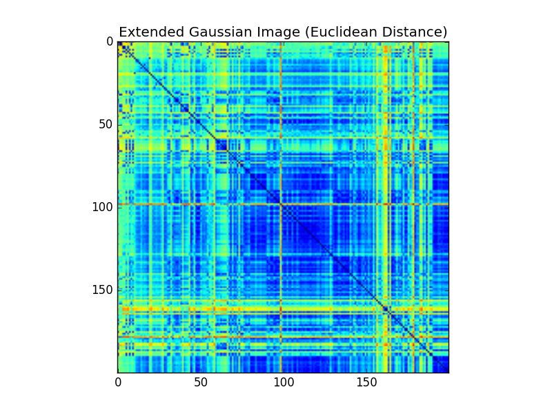

Shape Descriptors
-----------------

Please view this README rendered by GitHub at https://github.com/bmershon/shape-google

*All images, words, and code contained in this repository may be reproduced so long as the original author is given credit (Chris Tralie and Brooks Mershon).*

This assignment was completed as part of a course in 3D Digital Geometry (Math 290) taken at Duke University during Spring 2016. The course was taught by [Chris Tralie](http://www.ctralie.com/).

## Background

The purpose of this assignment is to implement functions which take samples from a 3D mesh and produce a signature for a given shape. These signatures take the form of one-dimensonal histograms which may be compared using various metrics, such as Euclidean distance and [Earth Mover's Distance](https://en.wikipedia.org/wiki/Earth_mover%27s_distance). A good descriptor will allow shapes to be classified well regardless of their scale and orientation (rotation) in space.

## Features

The following features were implemented:

- Mean-Center / RMS Normalize Point Clouds (6 Points)
- Shell Histograms (6 Points)
- Shell Histograms + Sorted Sectors (10 Points)
- Shell Histograms + PCA Eigenvalues (8 Points)
- D2 Distance Histogram (10 Points)
- A3 Angle Histogram (10 Points)
- Extended Gaussian Image (10 Points)

## Histogram Comparison

The following distance functions were implmented:

- Euclidean Distance (5 Points)
- 1D Earth Mover's Distance (10 Points)

## Performance Evaluation (25 points)

### Self-similarity Matrices

Before generating various precision recall graphs, I found it helpful to look for the general structure produced by each type of histogram and distance metric.

### Euclidean

#### Precision Recall

