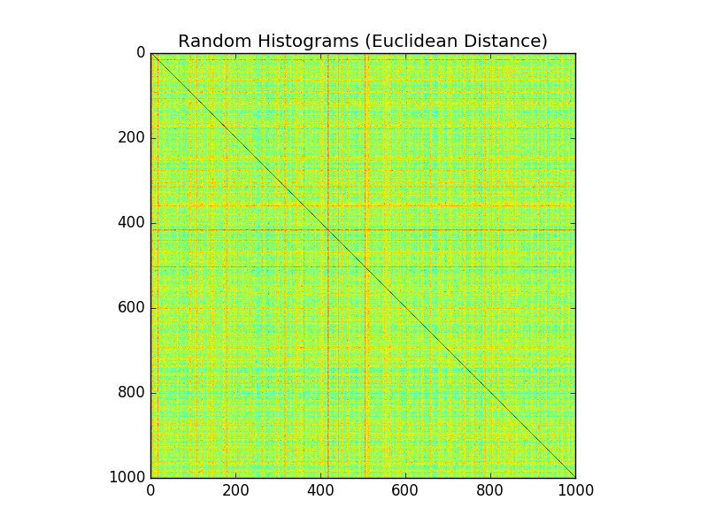

Shape Descriptors
-----------------

Please view this README rendered by GitHub at https://github.com/bmershon/shape-google

*All images, words, and code contained in this repository may be reproduced so long as the original author is given credit (Chris Tralie and Brooks Mershon).*

This assignment was completed as part of a course in 3D Digital Geometry (Math 290) taken at Duke University during Spring 2016. The course was taught by [Chris Tralie](http://www.ctralie.com/).

### Background

The purpose of this assignment is to implement functions which take samples from a 3D mesh and produce a signature for a given shape. These signatures take the form of one-dimensonal histograms which may be compared using various metrics, such as Euclidean distance and [Earth Mover's Distance](https://en.wikipedia.org/wiki/Earth_mover%27s_distance). A good descriptor will allow shapes to be classified well regardless of their scale and orientation (rotation) in space.

### Features

The following features were implemented:

- Mean-Center / RMS Normalize Point Clouds (6 Points)
- Shell Histograms (6 Points)
- Shell Histograms + Sorted Sectors (10 Points)
- Shell Histograms + PCA Eigenvalues (8 Points)
- D2 Distance Histogram (10 Points)
- A3 Angle Histogram (10 Points)
- Extended Gaussian Image (10 Points)

### Histogram Comparison

The following distance functions were implmented:

- Euclidean Distance (5 Points)
- 1D Earth Mover's Distance (10 Points)

### Performance Evaluation (25 points)

#### Self-similarity Matrices

Before generating various precision recall graphs, I found it helpful to look for the general structure produced by each type of histogram and distance metric.

##### Euclidean

In the self-similarity matrices below, blue is *close* and red is *far*. The classes of objects come in groups of 10, so there are 20 contiguous sets of 10 rows, each corresponding to a shape class (e.g., sword, biplane, sedan, table). We hope to see a 10x10 px blue square for each group along the diagonal, with *hotter* colors everywhere else in the same row. This means that a particular group is close to itself and far from others when the histogram signatures are compared using Euclidean distance.




We see that for each plot there is a clear structure in which blue squares appear along the diagonal. However, in the case of the **D2 descriptor**, it becomes clear why we see precision recall drop quickly after the first one or two shapes in a class (of 9 other shapes) are found. Looking across one row, we see the dark blue square on the diagonal, but we also see other dark blue pixels spread throughout the row. Therefore, only the first one or two shapes in a class are easily found to be *close* under a metric like Euclidean histogram distance. After the first couple shapes are receovered, many other shapes from outside the class end up having distances from the shape we are comparing it to that are *less* than the distance of the current shape to another member of the same class that has not yet been *recalled*.


The **Extended Gaussian Image descriptor** is interesting, because we see that for some shapes it is working rather well, and for other shapes it is failing to produce a nice 10x10 dark blue square along the diagonal. Why is this? Extended Gaussian Image histograms rely on first finding the principal axes of an object and performing a projection onto a new coordinate system in order to attempt to factor out rotation.

```py
def getEGIHistogram(Ps, Ns, SPoints):
    S = SPoints.shape[1]
    hist = np.zeros(S)

    # align point cloud with PCA axes
    A = np.dot(Ps, Ps.T)
    [eigs, R] = np.linalg.eig(A)
    rotated = np.dot(R.T, Ns)

    D = np.dot(rotated.T, SPoints) # N x M
    nearest = np.argmax(D, 1) # for each normal, the index of nearest spherical direction
    count = np.bincount(nearest) # number ofnormals associated with each direction
    hist[:count.shape[0]] = count
    return hist
```

In the case of the sword family of shapes, we see that the long blade and handle produce a fairly consistent set of principal axes. But other shapes may be more likely to experience poor PCA axes choices on account of their approximate rotational symmetries. If the choice of PCA axes is bad, we see that garbage in will produce garbage out: items within the same class may appear to have signature histograms that are far apart. This explains why the EGI histogram and Euclidean Distance produced a rather inconsistent structure across different classes in the above self-similarity matrix.

##### Earth Mover's Distance

We can also look at D2 and EGI self-similarity matrices when the Earth Mover's Distance is used:


The D2 self-similarity matrix created using Earth Mover's Distance is not substantially different than the previous D2 image using Euclidean distance. However, the EGI image is substantially different. Interestingly, the image indicates that switching from Euclidean distance to EMD trades problems: with EMD, shapes in the same class are close to each other and to shapes in other classes, where with Euclidean distance shapes in the same class are in many cases too far from each other.

### Precision Recall

#### Different descriptors
The precision recall graphs help summarize the operation of looking down a row of the self-similarity matrices and picking indices from coldest to warmest values until all 9 other shapes in the row's class have been recalled:

```py
def getPrecisionRecall(D, NPerClass = 10):
    PR = np.zeros(NPerClass - 1)
    Recalls = np.zeros((D.shape[0], NPerClass - 1))
    for i in range(D.shape[0]):
        v = np.zeros(NPerClass - 1)
        base = (i // NPerClass) * NPerClass
        group = range(base, base+10)
        index = np.argsort(D[i, :])
        recalled = 0;
        for k in range(len(index)):
            if index[k] in group and index[k] != i:
                recalled = recalled + 1
                v[recalled - 1] = recalled / float(max(k, 1))
        Recalls[i, :] = v
    PR = np.mean(Recalls, axis=0)
    return PR
```

A comparison of various types of histogram functions suggests that D2 is the best performer. One reason why D2 may perform well for this dataset is that D2 does not depend on rotation, so the other methods which attempt to align a model with PCA axes may be thrown off by shapes with rotational symmetries.

It is important to note that A3 is not too much worse than D2, yet EGI is considerably worse than all of the tested metrics. As was noted when we looked at the self-similarity matrices, EGI may suffer from poor PCA alignments due to rotational symmetries in many of the objects.I did find that EMD actually lowered the precision recall for EGI, but it seemed more appropriate to use this descriptor for EGI.

A summary of the unique features of the descriptors:

- **D2**: does not care about rotation
- **A3**: does not care about rotation, but performed worse than D2 on the first couple of recalled shapes
- **Shell**: does not care about rotation, performed nearly the same as A3 and the sectored shell descriptor
- **Sectored Shell**: does not care about rotation
- **EGI**: subject to poor PCA axes alignment, which makes shapes within the same class appear far under Euclidean, EMD
- **Random**: this control demonstrates that the other descriptors do in fact aid in classifying most of the shapes in a class


#### Changing parameters

- Increasing the number of samples increases the precision recall for D2 under Euclidean Distance.
- Binning has little effect on Shell Histograms.
- Earth Mover's Distance is actually worse for Extended Gaussian Image classification.
- The number of spherical directions used for EGI under Euclidean distance comparison had little effect on precision-recall.


